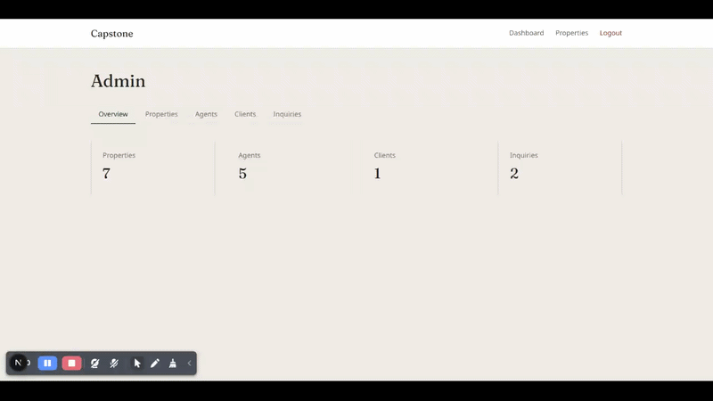
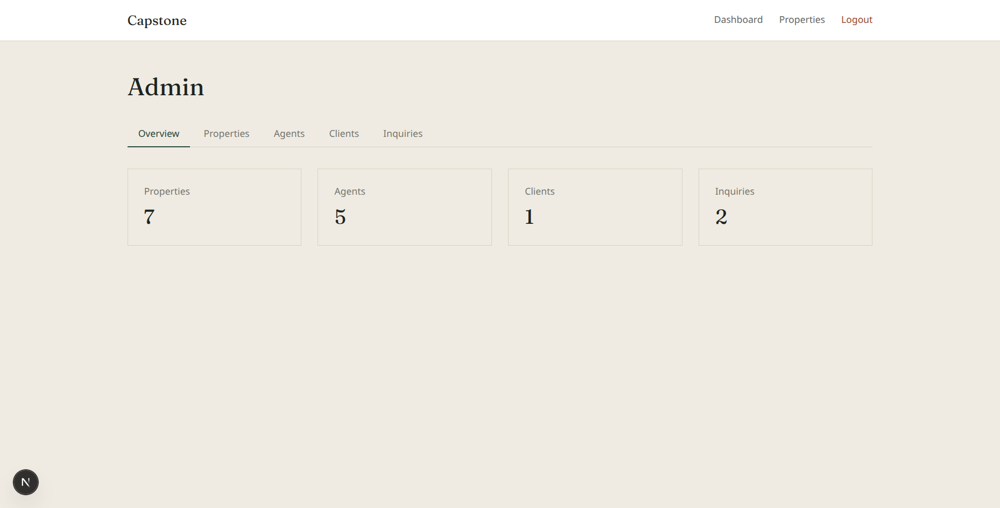
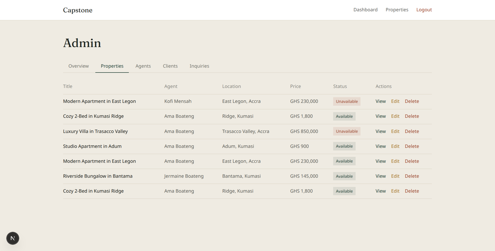
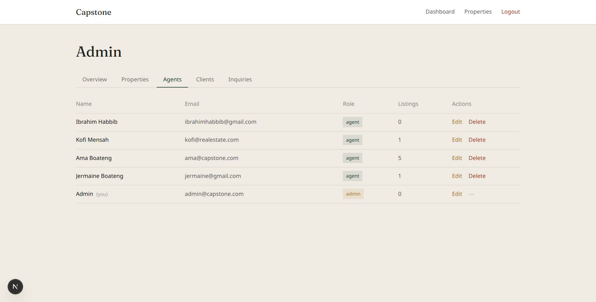
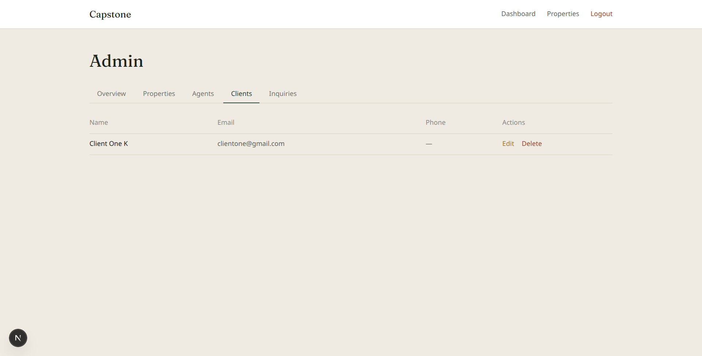

# Capstone - Real Estate Platform

A full-stack real estate platform that connects clients with property agents. Clients can browse and search available properties, while agents can create and manage property listings and respond to inquiries.

The frontend is built with **Next.js and React**, while the backend is powered by **Node.js, Express, PostgreSQL, and Prisma**.

---

## Table of contents

- [Features](#features)
- [Tech stack](#tech-stack)
- [Admin dashboard](#admin-dashboard)
- [Architecture](#architecture)
- [Getting started](#getting-started)
- [Environment variables](#environment-variables)
- [Project structure](#project-structure)

---

## Features

**For clients**
- Browse and search properties with filters (price, bedrooms, bathrooms, location)
- View detailed property pages with agent contact info
- Send inquiries directly to listing agents
- Personal dashboard with newest listings

**For agents**
- Register and manage a personal dashboard
- Create, edit, and delete their own property listings
- View and respond to inquiries on their listings, with status tracking (pending → contacted → converted/lost)

**For admins**
- Full platform oversight: manage all agents, clients, properties, and inquiries
- Reassign properties between agents
- Edit any agent or client profile, including role changes
- Safeguards against destructive actions — e.g. can't delete an agent with active listings, or a client with inquiries on record

**Platform-wide**
- JWT-based authentication with role-based access control (client / agent / admin)
- PostgreSQL database via Prisma ORM, with ownership checks enforced at the API level
- Responsive UI across all pages

---

## Tech stack

**Frontend**
- Next.js (App Router) + React + TypeScript
- Tailwind CSS
- Deployed on Vercel

**Backend**
- Node.js + Express
- PostgreSQL + Prisma ORM
- JWT authentication, bcrypt password hashing, Zod validation
- Deployed on Railway

---
## Admin Dashboard

Capstone includes a full admin panel for managing agents, clients, 
properties, and inquiries.



### Overview
Real-time counts across the platform.



### Managing properties
Admins can view, edit, reassign, or delete any listing - including 
reassigning a property to a different agent.



### Managing agents & clients
Full CRUD with safeguards - e.g. an admin can't delete an agent who 
still has active listings, or a client with inquiries on record.




### Admin access

Live admin credentials are available on request — reach out at [dicksonboateng@proton.me](mailto:dicksonboateng@proton.me) and I'll share login details for a walkthrough.

---

## Architecture

- Frontend fetches from the API using a JWT stored client-side, attached as a `Bearer` token on authenticated requests
- All authorization is enforced server-side (frontend route guards are UX only, never the real security boundary)
- Ownership and role checks happen per-route — e.g. an agent can only edit their own listings; an admin can edit any, with the same endpoint branching on `req.user.role`

---

## Getting started

### Prerequisites
- Node.js 18+
- A PostgreSQL database (local or hosted)

### Backend

```bash
cd server
npm install
cp .env.example .env   # fill in your DATABASE_URL and JWT_SECRET
npx prisma migrate dev
npx prisma db seed
npm run dev
```

### Frontend

```bash
cd client
npm install
cp .env.example .env.local   # set NEXT_PUBLIC_API_URL to your backend URL
npm run dev
```

---

## Environment variables

**Backend (`server/.env`)**
| Variable | Description |
|---|---|
| `DATABASE_URL` | PostgreSQL connection string |
| `JWT_SECRET` | Secret used to sign JWTs |
| `PORT` | Port the server runs on (default 3000) |

**Frontend (`client/.env.local`)**
| Variable | Description |
|---|---|
| `NEXT_PUBLIC_API_URL` | Base URL of the backend API, e.g. `http://localhost:3000/api` |

---

## Project structure

```
capstone/
├── client/                         # Next.js frontend
│   ├── app/
│   │   ├── admin/                  # Admin panel
│   │   │   ├── agents/[id]/edit/
│   │   │   ├── agents/
│   │   │   ├── clients/[id]/edit/
│   │   │   ├── clients/
│   │   │   ├── inquiries/
│   │   │   ├── properties/[id]/edit/
│   │   │   ├── properties/
│   │   │   ├── layout.tsx
│   │   │   └── page.tsx            # Overview
│   │   ├── dashboard/               # Agent dashboard
│   │   │   ├── inquiries/
│   │   │   ├── listings/
│   │   │   ├── profile/
│   │   │   ├── layout.tsx
│   │   │   └── page.tsx
│   │   ├── properties/               # Public listings
│   │   │   ├── [id]/edit/
│   │   │   ├── [id]/
│   │   │   ├── new/
│   │   │   └── page.tsx
│   │   ├── home/                      # Client dashboard
│   │   ├── login/
│   │   ├── register/
│   │   ├── layout.tsx                  # Root layout
│   │   └── page.tsx                     # Public homepage
│   ├── components/
│   │   ├── ConfirmModal.tsx
│   │   ├── InquiryCard.tsx
│   │   ├── InquiryForm.tsx
│   │   ├── Nav.tsx
│   │   ├── PropertyCard.tsx
│   │   ├── PropertyFilters.jsx
│   │   └── RequireAuth.tsx
│   ├── context/
│   │   └── AuthContext.tsx          # JWT session management
│   ├── hooks/
│   │   └── useHasMounted.ts
│   ├── lib/
│   │   ├── api.ts                    # API client functions
│   │   └── types.ts
│   └── public/capstone/               # README screenshots/demo
│
└── server/                         # Express backend
    ├── routes/
    │   ├── admin.js
    │   ├── agents.js
    │   ├── auth.js
    │   ├── clients.js
    │   ├── inquiries.js
    │   └── properties.js
    ├── middleware/
    │   ├── auth.js                  # requireAuth, requireAdmin, requireAgent, requireClient
    │   └── errorHandler.js
    ├── prisma/
    │   ├── migrations/
    │   ├── schema.prisma
    │   └── seed.js
    ├── utils/
    │   ├── AppError.js
    │   ├── logger.js
    │   └── validate.js               # Zod schemas
    ├── db/
    │   └── prisma.js                  # Prisma client instance
    ├── app.js
    └── server.js
```

---


## License

See [LICENSE](LICENSE).